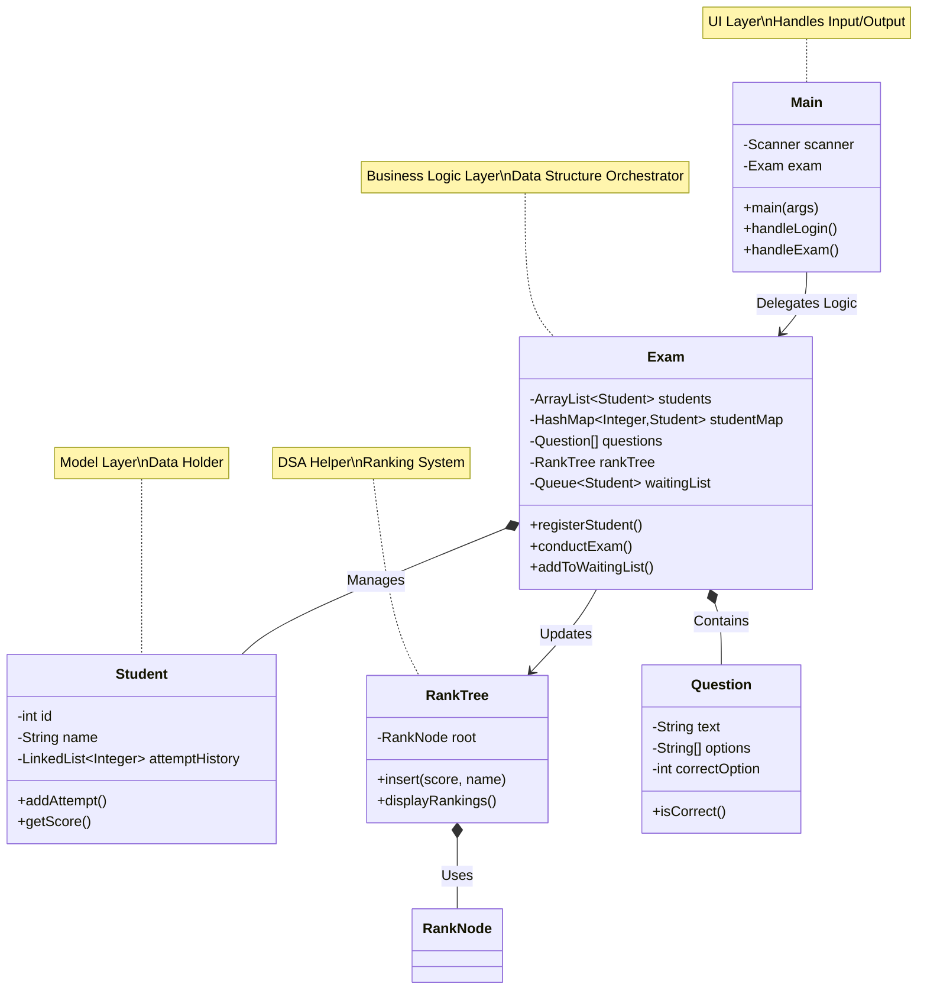

# System Architecture

## Overview
The **Online Exam System** is designed with a layered architecture, enforcing strict Separation of Concerns (SoC) between the User Interface (UI) and the Business Logic. It integrates multiple Data Structures and Algorithms (DSA) to handle specific sub-problems efficiently.

## Component Diagram (Mermaid)

## Data Structure Integration

| Component | Data Structure | Role | Time Complexity |
|-----------|----------------|------|-----------------|
| **Student Registry** | `ArrayList<Student>` | Maintain sorted list for Binary Search | O(1) amortized add |
| **Student Lookup** | `HashMap<Integer, Student>` | Fast O(1) login and retrieval | O(1) average |
| **Exam Questions** | `Question[]` (Array) | Fixed size, random access | O(1) access |
| **Attempt History** | `LinkedList<Integer>` | Sequential history of scores | O(1) insertion |
| **Rankings** | `Binary Search Tree` | Dynamic sorting of scores | O(log n) insert |
| **Waiting List** | `Queue<Student>` | FIFO processing of students | O(1) offer/poll |
| **Undo/Back** | `Stack<Integer>` | LIFO backtracking in exam | O(1) push/pop |

## Design Patterns & Principles

1.  **Separation of Concerns**: `Main.java` handles only UI, `Exam.java` handles logic.
2.  **Encapsulation**: All fields are `private` with public getters/setters.
3.  **Single Responsibility**: Each class has one clear purpose.
4.  **Composition**: `Exam` class composes multiple data structures to form the system.
